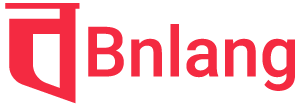

  

<h1 align="center">Bnlang – Bangla Programming Language</h1>

  A modern, dual-language programming language designed for <b>Bangla</b> and <b>English</b>.
  Built for Bangladesh, open to the world.

---

## 🌐 About Bnlang

**Bnlang** is a **production-ready programming language and runtime** that makes coding accessible in  
Bangla (বাংলা), and English.  

- ✍️ **Write in your language** — code in Bangla or English.  
- 🎓 **Made for learners** — perfect for students learning Computer Science in their native language.  
- ⚡ **Modern runtime** — efficient, expressive, and ready for real-world projects.  
- 🌍 **Cross-platform** — works on Windows, macOS, and Linux.  

---

## 🖥️ About This Website

This is the **official website of Bnlang**.  
It is built with modern web technologies and serves as the central hub for:  

- 📖 **Documentation** — Learn how to use Bnlang from beginner to advanced.  
- 🎓 **Learning resources** — Tutorials, guides, and educational material in Bangla, and English.  
- 📰 **Project updates** — News, announcements, and release information.  
- 👩‍💻 **Community contributions** — Developers can submit improvements to docs, tutorials, and the website itself.  

The website is open source, so developers and contributors can help improve the content, fix issues, and translate materials to make Bnlang more accessible worldwide.

---

## 👩‍💻 Contributing

We welcome contributions!  
- Fork the repo, create a branch, and submit a Pull Request.  
- Report issues and suggest features in the [Issue Tracker](https://github.com/bnlang/bnl-web/issues).  

See [CONTRIBUTING.md](./CONTRIBUTING.md) for more details.

---

## 📜 License

- Code: [BSD-3-Clause](./LICENSE)  
- Documentation: [CC BY-SA 4.0](./LICENSE-DOCS)  

---

## ™️ Trademark

**Bnlang** and the **Bnlang logo** are trademarks of the Bnlang Project.  
You may not use the name or logo to endorse or promote products derived from this project without prior written permission.

---
